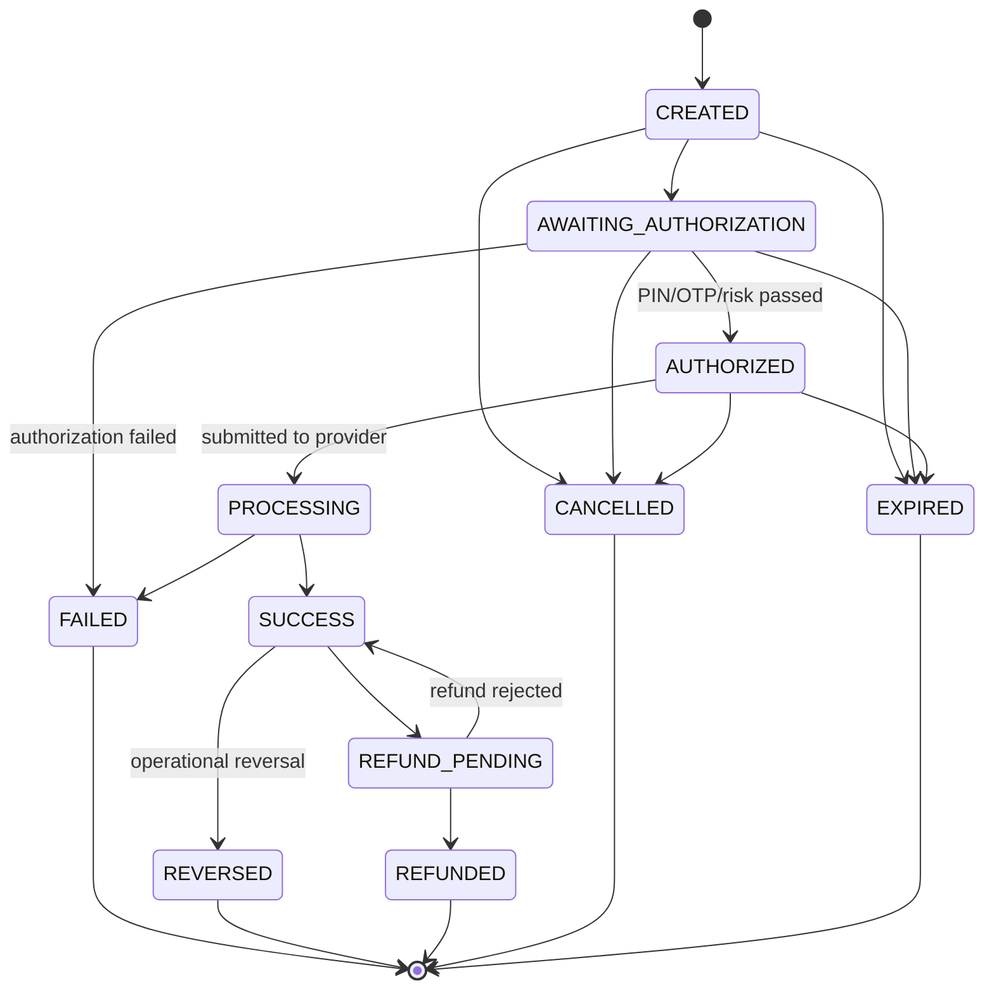

# Payment lifecycle, ledger and idempotency

Implemented today: the state machine and money helpers as pure code (`src/modules/payments/domain/payment-state.ts`, `src/common/utils/money.ts`). Persistence, ledger and idempotency are designed here and scheduled in BE-010 to BE-012.

## State machine



Rules:

- The transition table in code is the single source of truth; this diagram must match it (test: `tests/unit/payment-state.test.ts`).
- Terminal: FAILED, REVERSED, REFUNDED, CANCELLED, EXPIRED. No self-transitions.
- `PROCESSING` cannot be cancelled: once submitted to a provider only the provider outcome decides.
- Only full refunds are modelled initially; partial refunds need a separate refund entity (future decision).
- Frontend-facing statuses (`INITIATED`, `PROCESSING`, `SUCCESS`, `FAILED`, `REFUNDED`, `REVERSED`) map as: CREATED/AWAITING_AUTHORIZATION/AUTHORIZED → INITIATED; REFUND_PENDING → PROCESSING (refund); others 1:1; CANCELLED/EXPIRED shown as such.

### Persisting a transition (BE-012)

```ts
assertTransition(current.status, next);
const updated = await Payment.findOneAndUpdate(
  { paymentId, status: current.status, version: current.version },
  { $set: { status: next }, $inc: { version: 1 }, $push: { statusHistory: { $each: [entry], $slice: -20 } } },
  { new: true, session },
);
if (!updated) throw new AppError('PAYMENT_INVALID_STATE'); // lost a race
```

The status-conditional filter makes concurrent transitions safe: only one writer wins.

## Money representation

- Integer minor units (`amountMinor`) + ISO currency. INR exponent 2: ₹10.23 → `1023`.
- Decimal strings are converted by string manipulation, never `parseFloat`. Arithmetic uses safe-integer-checked helpers.
- Max whole digits: 13 (well within `Number.MAX_SAFE_INTEGER`). A per-transaction limit (BE-012) will be far lower.

## Ledger (BE-010)

Double-entry: every transfer writes entries whose signed sum is zero.

| Event | Debit | Credit |
| --- | --- | --- |
| Sandbox funding | SYSTEM:SANDBOX_FUNDING | USER:WALLET |
| Payment success | payer WALLET | payee WALLET |
| Refund | payee WALLET | payer WALLET |
| Reversal | payee WALLET | payer WALLET |

Sandbox accounting assumptions:

- The SANDBOX_FUNDING system account may go negative; it represents simulated money entering the system.
- User WALLET accounts may not go negative.
- Fees are zero in sandbox mode.
- Funds move on `SUCCESS` (single-phase). A hold/capture model (reserve on AUTHORIZED) is a documented future option if provider latency makes it necessary.

Procedure (one MongoDB transaction):

1. Conditional debit: `updateOne({ _id: payerAccount, cachedBalanceMinor: { $gte: amount } }, { $inc: { cachedBalanceMinor: -amount, version: 1 } })`; zero matches → `PAYMENT_INSUFFICIENT_FUNDS`.
2. Credit payee account.
3. Insert immutable `ledger_entries` with `balanceAfterMinor`.
4. Transition payment to SUCCESS.
5. Commit; then publish domain events.

`cachedBalanceMinor` is a projection; a reconciliation job (BE-027/BE-030) recomputes balances from entries and alerts on mismatch.

## Idempotency (BE-011)

- Header `Idempotency-Key` required on `POST /payments`, `/payments/:id/authorize`, `/refund`, `/payment-requests/:id/pay`.
- Record `{ userId, key, fingerprint = sha256(method + path + canonical body), state, response, expiresAt (24h) }` with unique index `{ userId, key }`.
- First request inserts `IN_PROGRESS`; a concurrent duplicate hits the unique index and receives 409 `PAYMENT_DUPLICATE_REQUEST` (or waits briefly and replays once completed).
- Same key + same fingerprint after completion → replay stored status/body.
- Same key + different fingerprint → 409 `PAYMENT_DUPLICATE_REQUEST`.

## Concurrency threats and controls

| Threat | Control |
| --- | --- |
| Double click / network retry | Idempotency key |
| Two tabs paying concurrently | Conditional debit with `$gte` guard inside a transaction |
| Racing status updates (webhook vs poller) | Status + version conditional updates |
| Duplicate webhook | Unique `{provider, eventId}` |
| Duplicate reward for same payment | Unique `{userId, sourceEventId}` |
